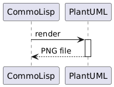

<a id="x-2840ANTS-PLANTUML-DOCS-2FINDEX-3A-40README-2040ANTS-DOC-2FLOCATIVES-3ASECTION-29"></a>

# 40ants-plantuml - Wrapper around PlantUML jar library

<a id="40-ants-plantuml-asdf-system-details"></a>

## 40ANTS-PLANTUML ASDF System Details

* Description: Wrapper around Plant`UML` jar library
* Licence: Unlicense
* Author: Alexander Artemenko <svetlyak.40wt@gmail.com>
* Homepage: [https://40ants.com/plantuml][577d]
* Bug tracker: [https://github.com/40ants/plantuml/issues][d36f]
* Source control: [GIT][aa24]
* Depends on: [alexandria][8236], [serapeum][c41d]

[][727f]


<a id="x-2840ANTS-PLANTUML-DOCS-2FINDEX-3A-3A-40INSTALLATION-2040ANTS-DOC-2FLOCATIVES-3ASECTION-29"></a>

## Installation

You can install this library from Quicklisp, but you want to receive updates quickly, then install it from Ultralisp.org:

```
(ql-dist:install-dist "http://dist.ultralisp.org/"
                      :prompt nil)
(ql:quickload :40ants-plantuml)
```
<a id="x-2840ANTS-PLANTUML-DOCS-2FINDEX-3A-3A-40USAGE-2040ANTS-DOC-2FLOCATIVES-3ASECTION-29"></a>

## Usage

Here is how to render a sequence diagram to `PNG` file:

```
CL-USER> (setf 40ants-plantuml:*path-to-jar*
               "~/plantuml-mit-1.2024.8.jar")

CL-USER> (40ants-plantuml:render "
  @startuml
  CommoLisp -> PlantUML : render
  activate PlantUML
  return PNG file
  @enduml
  "

#P"/tmp/diagram.png")
; No values
```
It will render an image like this:



<a id="x-2840ANTS-PLANTUML-DOCS-2FINDEX-3A-3A-40API-2040ANTS-DOC-2FLOCATIVES-3ASECTION-29"></a>

## API

<a id="x-2840ANTS-PLANTUML-DOCS-2FINDEX-3A-3A-4040ANTS-PLANTUML-3FPACKAGE-2040ANTS-DOC-2FLOCATIVES-3ASECTION-29"></a>

### 40ANTS-PLANTUML

<a id="x-28-23A-28-2815-29-20BASE-CHAR-20-2E-20-2240ANTS-PLANTUML-22-29-20PACKAGE-29"></a>

#### [package](059c) `40ants-plantuml`

<a id="x-2840ANTS-PLANTUML-DOCS-2FINDEX-3A-3A-7C-4040ANTS-PLANTUML-3FFunctions-SECTION-7C-2040ANTS-DOC-2FLOCATIVES-3ASECTION-29"></a>

#### Functions

<a id="x-2840ANTS-PLANTUML-3ARENDER-20FUNCTION-29"></a>

##### [function](82bd) `40ants-plantuml:render` diagram-code output-filename

<a id="x-2840ANTS-PLANTUML-DOCS-2FINDEX-3A-3A-7C-4040ANTS-PLANTUML-3FVariables-SECTION-7C-2040ANTS-DOC-2FLOCATIVES-3ASECTION-29"></a>

#### Variables

<a id="x-2840ANTS-PLANTUML-3A-2APATH-TO-GRAPHVIZ-2A-20-28VARIABLE-29-29"></a>

##### [variable](2ef6) `40ants-plantuml:*path-to-graphviz*` nil

If given, should be a path to `dot` binary of Graphviz. Will be passed as -graphvizdot option to the `PlantUML`.

<a id="x-2840ANTS-PLANTUML-3A-2APATH-TO-JAR-2A-20-28VARIABLE-29-29"></a>

##### [variable](cfb2) `40ants-plantuml:*path-to-jar*` nil

Set this variable to a path to the plantuml.jar. Note, there are different builds of plantuml with different licensing.


[577d]: https://40ants.com/plantuml
[aa24]: https://github.com/40ants/plantuml
[727f]: https://github.com/40ants/plantuml/actions
[059c]: https://github.com/40ants/plantuml/blob/c4f787c0f5cca7b3636a15cfc03281272654f15a/src/core.lisp#L1
[cfb2]: https://github.com/40ants/plantuml/blob/c4f787c0f5cca7b3636a15cfc03281272654f15a/src/core.lisp#L17
[2ef6]: https://github.com/40ants/plantuml/blob/c4f787c0f5cca7b3636a15cfc03281272654f15a/src/core.lisp#L22
[82bd]: https://github.com/40ants/plantuml/blob/c4f787c0f5cca7b3636a15cfc03281272654f15a/src/core.lisp#L46
[d36f]: https://github.com/40ants/plantuml/issues
[8236]: https://quickdocs.org/alexandria
[c41d]: https://quickdocs.org/serapeum

* * *
###### [generated by [40ANTS-DOC](https://40ants.com/doc/)]
